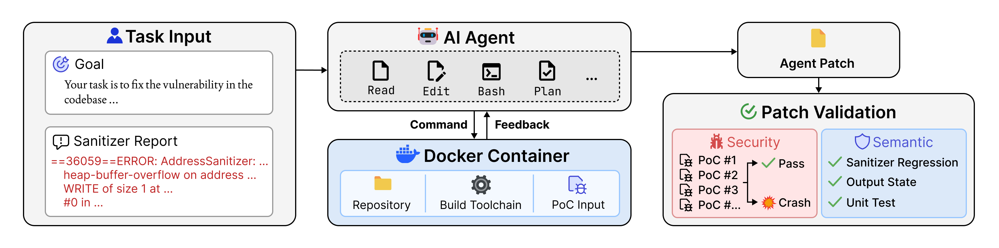

# PatchBench: Evaluating AI Agents for Vulnerability Patching

[](https://arxiv.org/abs/2609.04075)
[](LICENSE)



## Overview

PatchBench is a benchmark for evaluating AI agents on realistic vulnerability patching tasks, including 213 tasks from 32 GitHub popular projects. It selects vulnerabilities whose ground-truth fixes lie outside the crash stack and uses vulnerability transplant and code mutations to mitigate the risks of surface-level fixes and patch memorization. 

We develop new patch validation methods that thoroughly evaluate both **security** and **semantic** correctness of agent patches. Across 11 state-of-the-art agents, including the top three AIxCC agents, the original PoC-only validation inflates the patching task solve rate of agents by 1.83 $\times$ on average.

`infer` runs an agent against the task and collects its patch. Four commands then validate that patch, one per check, and `analyze` joins their reports.

| Command | Check | Passes when |
|---|---|---|
| `poc` | original PoC | the original PoC no longer crashes |
| `replay` | security validation, sanitizer regression | no input in the crashing or benign corpus triggers a sanitizer error |
| `unittest` | unit test check | every test that passes on the reference-patched repo still passes |
| `verify` | output state check | output on benign inputs matches the reference-patched repo byte for byte |

A patch counts as **solved** when it passes security validation and all three semantic checks.

## Pre-requisites

### 1. Corpus

The two fuzzing corpora and the output state check metadata ship as zip archives due to size limitation. Please download from [Google Drive](https://drive.google.com/drive/folders/1x18BrFGxtQjk0rW3PsMsrYcn3ZiD08G6?usp=drive_link), and unzip under the `data` folder.

```bash
cd data
unzip -q corpus.zip && unzip -q corpus_outputs.zip
cd ..
```

This produces `data/corpus/` and `data/corpus_outputs/`, about 22 GB together.

### 2. Images

Each task runs in its own build container, published one image per task id. `pull_images.sh` pulls them in parallel.

```bash
./pull_images.sh                     # every id in metadata.json
./pull_images.sh --jobs 8            # more parallelism (default 4)
```

Images are a few GB each, and all 213 come to roughly 870 GB, so pull only the ids you plan to run. Re-running the script retries anything that failed; layers already downloaded are skipped.

### 3. Install

We use `uv` as the python package manager.

```bash
uv sync
```

Set the API keys for whichever models you plan to run. They are forwarded into the container at run time and never written into the generated scripts.

```bash
export OPENAI_API_KEY=...
export ANTHROPIC_API_KEY=...
export GEMINI_API_KEY=...
```

## Commands

```bash
ARGS="--agents openhands --model-names gpt-5.6-sol"

uv run patchbench infer    $ARGS
uv run patchbench poc      $ARGS --rerun
uv run patchbench unittest $ARGS --rerun
uv run patchbench replay   $ARGS --rerun
uv run patchbench verify   $ARGS --rerun
uv run patchbench analyze
```

`infer` must run first, because the other stages apply the patch it produces. The four validation stages are independent of each other and may run in any order, or concurrently.

Every command except `analyze` takes the same flags.

Required flags: 

- `--agents A [A ...]` agent frameworks to run. It supports `openhands`, `codex` and `claudecode`. For the AIxCC CRSs, see their own repositories, [Atlantis](https://github.com/Team-Atlanta/aixcc-afc-atlantis), [RoboDuck](https://github.com/theori-io/aixcc-afc-archive) and [Buttercup](https://github.com/trailofbits/afc-buttercup)
- `--model-names M [M ...]` models to run under each agent

Optional flags:

- `--ids ID [ID ...]` runs a subset, and defaults to every id in `metadata.json`
- `--tag LABEL` separates otherwise identical runs. It is appended to every generated name, and omitted entirely when unset (the default)
- `--num-workers N` sets how many tasks run at once (default 20)
- `--rerun` starts containers, and is off by default. It behaves different between `infer` and validation steps:
  - For `infer`: Ignore already inferred tasks (i.e., under `./out/diffs`) for a configuration. Without it, it will still run the inference for the specified agent configuration against the rest tasks. 
  - For validation: Ignore the whole validation process for a configuration. Without it a validation stage only re-derives verdicts from a previous run's saved output, which makes changing a parser cheap. Therefore, for a brand new run, you need to set this flag
- `--no-setup` reuses the previously generated scripts, and is off by default

`analyze` takes no flags, because the reports record which tasks and configurations ran.

## One Quick Example

One task end to end, e.g., using Claude Code and claude-opus-4-8 on task 11351 (harfbuzz).

```bash
ARGS="--agents claudecode --model-names claude-opus-4-8 --ids 11351 --num-workers 1"

uv run patchbench infer    $ARGS
uv run patchbench poc      $ARGS --rerun
uv run patchbench unittest $ARGS --rerun
uv run patchbench replay   $ARGS --rerun
uv run patchbench verify   $ARGS --rerun
uv run patchbench analyze
```

`infer` writes the agent's patch to `out/diffs/11351/claudecode_claude-opus-4-8.diff`. Each validation stage writes its verdict to `out/reports/{stage}/claudecode_claude-opus-4-8.json`, and `analyze` joins the five into `out/results/claudecode_claude-opus-4-8.csv`, one row for task 11351.


`Scoreboard` reads whichever reports exist, so a partial run still analyzes.

## Data Layout

`data/` holds the benchmark inputs and is not created by a run.

| File | Contents |
|---|---|
| `metadata.json` | Per-task project, commit, fuzzer and sanitizer report |
| `unittest.json` | Unit-test results on the reference-patched repo, used as the answer key |
| `corpus/{id}/C1/` | Crashing corpus, PoC variants including the original PoC, unzipped from `corpus.zip` |
| `corpus/{id}/C2/` | Benign corpus, inputs that crash neither the task nor the reference repo |
| `corpus_valid.json` | The C2 inputs with a stable reference output, per task |
| `corpus_outputs/{id}/` | Reference-patched outputs for those inputs, unzipped from `corpus_outputs.zip` |
| `fuzz_targets.csv` | Per-task fuzz-target source, binary and output paths inside the image |
| `instrumented_targets/{id}/` | Fuzz-target sources instrumented to record the output state |

The two corpora come from PoC-seeded directed fuzzing `ConcFuzz` (files ends with `.bin`) plus the harness's own OSS-Fuzz engine (other files), deduplicated and then split by whether an input crashes the task repository but not the reference-patched one.

`harnesses/metadata.json` is a reduced copy of `data/metadata.json`. It is mounted into the inference container, so it omits the ground-truth patch and commits the agent must not see.

Set `PATCHBENCH_ROOT` to run against a working tree other than the one containing the package.

## Outputs

```
out/
  diffs/{id}/{agent}_{model}[_{tag}].diff
                       patches produced by the agents
  scripts/{stage}/     the generated docker run scripts
  logs/{stage}/{id}/   container stdout, stderr, agent transcripts
  reports/{stage}/{agent}_{model}[_{tag}].json
                       one report per stage and configuration
  results/{agent}_{model}[_{tag}].csv
                       per-task verdicts for one configuration
  results/summary.csv  one row per configuration
```

Columns in `results/`.

| Column | Check |
|---|---|
| `patch_produced` | `infer` returned a non-empty diff |
| `poc`, `poc_pass` | original PoC verdict, one of `pass`, `crash`, or an error string |
| `build_failed` | the patched tree did not compile |
| `replay_c1` | security validation, no crashing-corpus input triggers a sanitizer error |
| `replay_c2` | sanitizer regression, no benign-corpus input triggers one either |
| `replay_pass` | both corpora clean |
| `unittest_pass` | every reference-passing test still passes |
| `verify_pass` | every benign output matches the reference |


## Cite
```latex
@misc{shen2026PatchBench,
  title = {{{PatchBench}}: Evaluating {{AI}} Agents for Vulnerability Patching},
  author = {Shen, Chihao and Li, Jiacheng and Mahajan, Aastha and Tian, Jeffery Siyuan and Kwon, Yonghwi and Chen, Yizheng},
  year = 2026,
  number = {arXiv:2609.04075},
  eprint = {2609.04075}
}
```